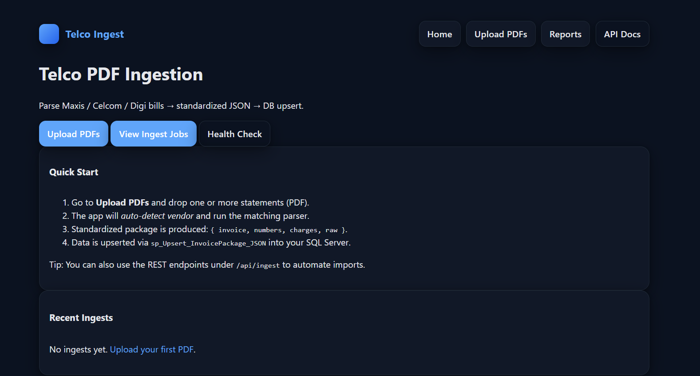
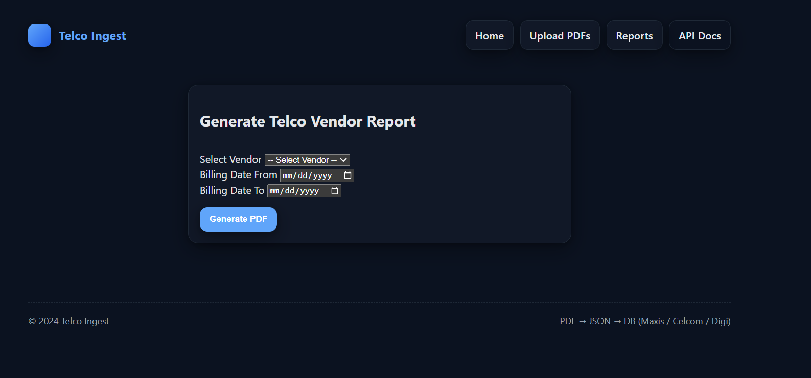

# Telco Ingest — Automated Telco Billing Extraction (Maxis • Celcom • Digi)

An **Automated Billing Extraction System** that ingests telco invoice PDFs, extracts billing data, and persists it into **SQL Server**.  
After ingestion, the system **automatically maps each line/number to the correct “Upon / Branch” name** (based on the number) and generates a **brief vendor report** to support the payment approval & processing workflow.

---

## ✅ What this project does

**PDF → Vendor Parser → Standardized JSON → SQL Server UPSERT → Auto Branch Mapping → Payment Report (PDF)**

1. Upload **Maxis / Celcom / Digi** invoice PDFs using the web UI or REST API.
2. The app **auto-detects the vendor** and runs the matching parser.
3. Output is normalized into a single JSON envelope: `{ invoice, numbers, charges, raw }`.
4. Data is persisted into SQL Server using vendor-specific stored procedures:
   - `sp_Upsert_InvoicePackage_JSON` (Maxis)
   - `sp_Upsert_InvoicePackage_JSON_Celcom`
   - `sp_Upsert_InvoicePackage_JSON_Digi`
5. After DB upsert, the system runs **mapping procedures** to populate **Upon/Branch** based on normalized phone numbers:
   - `sp_MapUpon_Maxis_CurrentCharges`
   - `sp_MapUpon_Celcom_RegisteredMobile`
   - `sp_MapUpon_Digi_ServiceSummary`
6. Generate a **Vendor Report PDF** (date range + vendor filter) to proceed with payment.

---

## 🖼️ UI Screenshots

### Home


### Upload PDFs


### Vendor Report


---

## 🧰 Tech Stack

- **Backend:** FastAPI (Python)
- **UI:** Jinja2 templates + static CSS
- **Parsing:** pdfplumber / PyMuPDF / pdfminer
- **Database:** SQL Server (via `pyodbc`)
- **Reporting:** PDF generation using `pdfkit` (**requires wkhtmltopdf**)

---

## 📁 Project Structure

```text
TELCO/
├── app/
│   ├── main.py                 # FastAPI entry point
│   ├── core/                   # config + SQL Server connection
│   ├── routers/                # UI + API routes
│   ├── services/               # persistence + DB helpers
│   ├── reports/                # vendor report PDF generator
│   └── ui/                     # templates + static assets
├── parsers/                    # vendor parsers (maxis/celcom/digi)
├── uploads/                    # uploaded PDFs
├── import_queue/               # optional folder ingestion queue
├── exports/                    # optional exports
└── output_reports/             # generated PDF reports
```

---

## ⚡ Quick Start (Local)

### 1) Create venv & install dependencies
```bash
python -m venv venv
venv\Scripts\activate
pip install -r requirements.txt
```

### 2) Configure environment variables
Create a `.env` in the project root (recommended):

```env
# App
APP_ENV=dev
APP_HOST=127.0.0.1
APP_PORT=8000

# Database (recommended: full ODBC string)
SQLSERVER_CONN_STR=Driver={ODBC Driver 17 for SQL Server};Server=localhost;Database=Telco Bills;UID=sa;PWD=your_password;Encrypt=no;TrustServerCertificate=yes;

# Persistence
TELCO_PERSIST_MODE=SP
ENABLE_DB_WRITE=true

# Paths (optional)
UPLOAD_DIR=uploads
IMPORT_WATCH_DIR=import_queue
EXPORT_DIR=exports
OUTPUT_REPORT_DIR=output_reports
```

### 3) Run the server
**Option A**
```bash
uvicorn app.main:app --reload --host 127.0.0.1 --port 8000
```

**Option B (Windows)**
```bat
run_server.bat
```

Open:
- UI: `http://127.0.0.1:8000/`
- API Docs (Swagger): `http://127.0.0.1:8000/docs`

---

## 🌐 Main Endpoints

### UI
- `GET /` → Home
- `GET /ui/upload` → Upload PDFs
- `GET /ui/reports` → Generate vendor report PDF

### API (JSON)
- `POST /ingest/file` → upload a single PDF (auto-detect vendor)
- `POST /ingest/batch` → upload multiple PDFs
- `GET  /ingest/detect?path=...` → detect vendor from a PDF path
- `POST /ingest/folder` → ingest all PDFs from a folder path
- `POST /ingest/upsert` → upsert a JSON invoice package
- `GET  /health` → health check

---

## 🗄️ Database Notes (SQL Server)

This project is designed for SQL Server and uses:
- Vendor-specific **UPSERT stored procedures** (recommended for production)
- Optional table-based writes (configurable)
- **Mapping procedures** to fill **Upon/Branch** fields automatically

> ⚠️ Ensure your SQL Server database contains the required tables + stored procedures before enabling DB writes.

---

## 🧾 Reporting (Payment Summary)

The Reports page lets you:
- Choose a vendor (Maxis / Celcom / Digi)
- Select a billing date range
- Generate a **Vendor Report PDF** (summary + line details) for payment processing

✅ Reporting uses **pdfkit**, so you must install **wkhtmltopdf** on the machine.

---

## 🛠️ Common Issues

### “pdfkit/wkhtmltopdf not found”
Install wkhtmltopdf and ensure it’s in your PATH.  
See: `INSTALL_WKHTMLTOPDF.txt` (included in this repo)

### SQL Server ODBC Driver errors
Install **ODBC Driver 17 (or 18)** for SQL Server and verify your connection string.

---

## 👤 Author
**Md Saiful Arefin**  
Final-Year CS (Data Science) — Albukhary International University, Malaysia

---

## 📄 License
Educational / internal use. Customize as needed for enterprise deployment.
